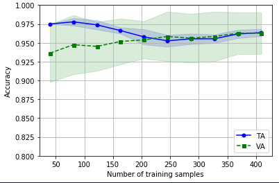
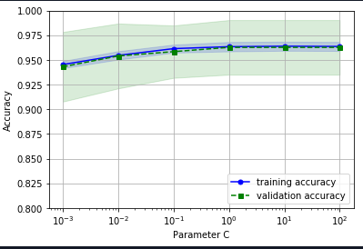

<h2>Brest cancer and mignanie detection </h2>
(This include prediction,
Visualtion of or train test error,
checking visually over and under fitting in model
)

<h3> Visualtion of or train test error  </h3>

<h3> Addressing overfitting and underfitting with validation curves </h3>
